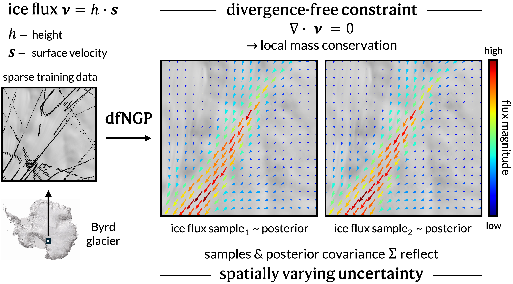
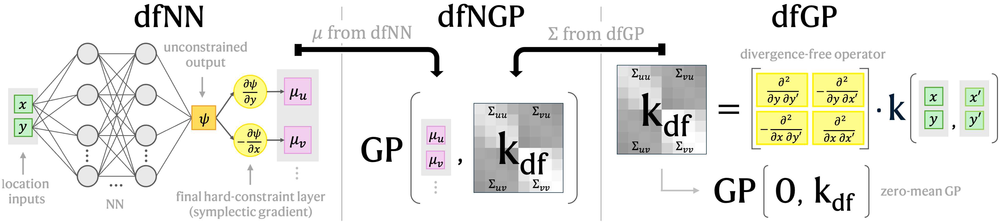

# dfNGP
Divergence-free Neural Gaussian Processes 

## Run experiments

### Set up the environment

Follow these steps to set up the environment for reproducing our results.

Create a new environment named `dfngp_env` with Python 3.10: 

`conda create -n dfngp_env python=3.10`

Follow the prompts to complete creation. Then activate the environment with:

`conda activate dfngp_env`

To install the CUDA-enabled version of PyTorch, use the appropriate build for your system. Our experiments were run using a GPU with CUDA 12.1, so we install:

`pip install torch==2.5.1 torchvision torchaudio --index-url https://download.pytorch.org/whl/cu121`

Next, use `pip` to install all required packages from the `requirements.txt` file, as well as their dependencies.

`pip install -r /home/kim/ice_thickness/requirements.txt`

Installation may take a few minutes.

### Experiments on simulated data

Once dfNGP_env is activated, run the experiments on simulated data with the following commands from the terminal:

- `python run_sim_experiments_dfGP.py`
- `python run_sim_experiments_dfGPcm.py`
- `python run_sim_experiments_dfNGP.py`
- `python run_sim_experiments_dfNN.py`
- `python run_sim_experiments_GP.py`
- `python run_sim_experiments_PINN.py`

All results and outputs will be saved in the respective model folder within [results_sim](results_sim). We will not upload all results to github due to space limitations. Each script runs each experiment for NUM_RUN = 8 times with different initialisations for a robust evaluation. 

### Experiments on real data

The already preprocessed train & test pytorch tensors containing real data from three regions within the Byrd glacier catchment in East Antarctica are provided in [real_data](data/real_data). Experiments on REAL will use these tensors. Once dfNGP_env is activated, run the experiments on real data with the following commands from the terminal:

- `python run_real_experiments_dfGP.py`
- `python run_real_experiments_dfGPcm.py`
- `python run_real_experiments_dfNGP.py`
- `python run_real_experiments_dfNN.py`
- `python run_real_experiments_GP.py`
- `python run_real_experiments_PINN.py`

All results and outputs will be saved in the respective model folder within [results_real](results_real). 

For greater reproducibility, transparancy, and data provenance we also provide the full **preprocessing pipeline** from data download to train/test tensor.

## Preprocessing pipeline - Real Antarctic ice flux data

Preface: To reproduce the real data experiments, you can also just run the scripts on the provided, much smaller, already preprocessed data. We include the following downloading and preprocessing pipeline for full **reproducibility**.

### Download Bedmap
- In `real_data_step1__download_bedmap123.py` replace `path_to_bedmap_data_folder` with your own local path. Run the python script with `python real_data_step1_download_bedmap123.py` from the terminal. This will automatically download, unzip, and organise all **Bedmap** data files. This script works on the os operating system. If you have trouble with this script or you are not on os, also see this [BAS resource from the Geophyscis Book by the UK Polar Centre](https://antarctica.github.io/PDC_GeophysicsBook/BEDMAP/Downloading_the_Bedmap_data.html) for useful information.
- 
<strong>WARNING:</strong> This script downloads 11 GB of data!

    - Bedmap1: 0.157 GB
    - Bedmap2: 3.2 GB
    - Bedmap3: 6.8 GB
- The script directly downloads all standardised .csv files from the Bedmap1, Bedmap2 and Bedmap3 collections from the [UK Polar Data Centre](https://www.bas.ac.uk/data/uk-pdc/). The lists of .csv files are visible on [this Bristish Antarctic Survey (BAS) webpage](https://www.bas.ac.uk/project/bedmap/#data).
- Also check out this [Github repository](https://github.com/kimbente/bedmap) for some additional analysis of Bedmap123 data.
- Bedmap(3) references:
    - *Pritchard, Hamish D., et al. "Bedmap3 updated ice bed, surface and thickness gridded datasets for Antarctica." Scientific data 12.1 (2025): 414.*
    - *Frémand, Alice C., et al. "Antarctic Bedmap data: Findable, Accessible, Interoperable, and Reusable (FAIR) sharing of 60 years of ice bed, surface, and thickness data." Earth System Science Data 15.7 (2023): 2695-2710.*

### Preprocess Bedmap

- In `real_data_step2_preprocess_bedmap123.py`, specify your preference about which variable you care about by setting bool_remove_rows_without_ice_thickness and/or bool_remove_rows_without_bed_elevation. Also make sure you set `path_to_bedmap_data_folder` to the same path you used for the download script. We set `bool_remove_rows_without_ice_thickness = True` because we will be using ice thickness measurements.
    - For only `bool_remove_rows_without_ice_thickness = True` the resulting data set contains ~ 82 M points (i.e. rows.) and is 9.5 GB large.
    - For only `bool_remove_rows_without_bed_elevation = True` the resulting data set contains ~ 67 M points (i.e. rows.)
- Run the script with `python real_data_step2_preprocess_bedmap123.py` from the terminal.
- The script combines all csv files into a standardised pd.Dataframe (pandas) and performs a set of cleaning and preprocessing steps.
- Number of csv files to combine: 151 
    - Number of bedmap1 csv files: 1
    - Number of bedmap2 csv files: 66
    - Number of bedmap3 csv files: 84
- Next, the data is subsetted for the broader Byrd region. The subset of data for the 300 x 300 km Byrd area is more managable in size and only contains 750k data points, reducing the file size to 0.085 GB. These are the Antarctic Polar Stereographic coordinates (see [EPSG:3031](https://epsg.io/3031)) used to subset the data. (For a user-friendly, non-programmatic conversion between and Polar Stereographic Coordinates we recommend [this conversion webtool by the Polar Geospatial Center (University of Minnesota)](https://www.pgc.umn.edu/apps/convert/).)
    - x_min = 350_000
    - x_max = 650_000
    - y_min = -1_000_000
    - y_max = -700_000

### Generate train-test regions

Go through the IPython notebook `real_data_step3_generate_train_test_regions.ipynb` to generate the train and test tensors for the three regions, which are already provided in [real_data](data/real_data)
- Since the Bedmap data that we just downloaded is combined with ice velocity observations, these need to be downloaded too. Download **MEaSUREs InSAR-Based Antarctica Ice Velocity Map, Version 2** from (the NSIDC website)[https://nsidc.org/data/nsidc-0484/versions/2]. See [here for the documentation/user guide](https://nsidc.org/sites/default/files/nsidc-0484-v002-userguide.pdf).
    - MEaSUREs InSAR Antarctica reference: *Rignot, E., Mouginot, J. & Scheuchl, B. (2017). MEaSUREs InSAR-Based Antarctica Ice Velocity Map. (NSIDC-0484, Version 2). [Data Set]. Boulder, Colorado USA. NASA National Snow and Ice Data Center Distributed Active Archive Center. https://doi.org/10.5067/D7GK8F5J8M8R.*
- Again, change the path to the preprocessed Bedmap123 data to your local path and specify the path to the ice velocity observations. 
- The code handles firn corrections, performs some meta data analysis, and produces visualisations to get on overview over the data.
- The notebook subsets three regions within the wider Byrd glacier catchment for our experiments. Byrd Glacier drains a large part of the East Antarctic Ice Sheet (EAIS) and flows into the Ross Ice Shelf. Hence, the Byrd Subglacial Basin has fast flowing ice and an interesting and scientifically important bed topography. These boundries are given in Polar Stereographic coordinates:
    - Citation: **Rignot, E., Mouginot, J. & Scheuchl, B. (2017). MEaSUREs InSAR-Based Antarctica Ice Velocity Map. (NSIDC-0484, Version 2). [Data Set]. Boulder, Colorado USA. NASA National Snow and Ice Data Center Distributed Active Archive Center. https://doi.org/10.5067/D7GK8F5J8M8R.**
- Again, change the path to the preprocessed Bedmap123 data to your local path and specify the path to the ice velocity observations. 
- The code handles firn corrections, performs some meta data analysis, and produces visualisations to get on overview over the data.
- We use data from three regions within the wider Byrd glacier catchment. These are the Polar Stereographic coordinates of the respective regions:
    - Upper Byrd (70 x 70 km)
        - upper_byrd_x_min = 400_000
        - upper_byrd_x_max = 470_000
        - upper_byrd_y_min = -800_000
        - upper_byrd_y_max = -730_000
    - Mid Byrd (70 x 70 km)
        - mid_byrd_x_min = 395_000
        - mid_byrd_x_max = 465_000
        - mid_byrd_y_min = -870_000
        - mid_byrd_y_max = -800_000
    - Lower Byrd (30 x 30 km)
        - lower_byrd_x_min = 420_000
        - lower_byrd_x_max = 450_000
        - lower_byrd_y_min = -910_000
        - lower_byrd_y_max = -880_000
- All 6 train/test tensors have the following five columns:
    - x coordinate [original units: Polar Stereographic X, now: min-max normalised to (0,1)]
    - y coordinate [original units: Polar Stereographic Y, now: min-max normalised to (0,1)]
    - *surface elevation* [original units: m, now: km] (this is auxiliary information, not currently used)
    - ice flux in x-direction [original units: m^2 / year i.e. m^3 / m / year, now: scaled to reduce magnitude]
    - ice flux in y-direction [original units: m^2 / year i.e. m^3 / m / year, now: scaled to reduce magnitude]

## List of files with brief explanantions

To aid navigation, we provide a list of folders and files (each in alphabatical order), along with brief descriptions of their contents. Align with the automatic ordering of github, we start with folders, followed by files.

- [data](data)
    - [real_data](data/real_data) contains train and test data as pytorch tensors for the three selected regions of Byrd glacier, lower, mid and upper.
        - [corner_coordinates_byrd_for_velocity.csv](data/real_data/corner_coordinates_byrd_for_velocity.csv) contains coordinates used for preprocessing the ice velocity data before combining it with the ice thickness measurements.
        - [corner_coordinates_byrd_regions_experiments.csv](data/real_data/corner_coordinates_byrd_regions_experiments.csv) contains the coordinates of the three experimental regions, as well as scaling parameters that can be used to transform data back to original units.
    - [sim_data](data/sim_data)
        - [x_train_lines_discretised_0to1.pt](data/sim_data/x_train_lines_discretised_0to1.pt) defines the input locations for the simulated data experiments. The corresponding train and test vectors are generated within the experiment scripts, using the functions written in [simulate.py](simulate.py).
        - [x_train_lines_start_end_0to1.csv](data/sim_data/x_train_lines_start_end_0to1.csv) defines that start and end points of the input training line segments. This allows to visualise them as lines, rather than only with training points.
- [figues_real](figures_real)
    - Contains folders for each model.
- [figues_sim](figures_sim)
    - Contains folders for each type of visualisation. Due to storage constrains we do not upload these to Github but they can be generated by running the notebook below.
    - [visualise_sim_tiles.ipynb](figures_sim/visualise_sim_tiles.ipynb) is a notebook that creates all visualisation tiles, which are used for the figures in the paper.
    - [cmap_berlin_tensor.pt](figures_sim/cmap_berlin_tensor.pt) defines a custom cmap used in visualise.py.
- [preprocess](prerpocess)
    - [real_data_step1_download_bedmap123.py](preprocess/real_data_step1_download_bedmap123.py) downloads all standardised raw data from Bedmap1, Bedmap2, and Bedmap 2.
    - [real_data_step2_preprocess_bedmap123.py](preprocess/real_data_step2_preprocess_bedmap123.py) preprocesses and cleans the downloaded raw datasets to then generate one pd.Dataframe.
    - [real_data_step3_preprocess_regions.ipynb](preprocess/real_data_step3_preprocess_regions.ipynb)
    - [real_preprocess.py](preprocess/real_preprocess.py) contains functions need in the step 3 preprocessing notebook.
- [README_assets](README_assets) stores the visualisations used within this README.md
- [results_real](results_real)
    - [generate_latex_results_table_real.py](latex_table/generate_latex_results_table_real.py) generates a latex format table from the real experiment results (truncating, formatting). The generated file is called generated_latex_results_table_real.txt and saved in the same directory.
    - Due to size constraints, we do not upload all experimental outputs to GitHub. However, running the experiments will automatically generate and save all results and outputs in this directory.
- [results_sim](results_sim)
    - [generate_latex_results_table_sim.py](latex_table/generate_latex_results_table_sim.py) generates latex format table from SIM experiment results (truncating, formatting). The generated file is called generated_latex_results_table_sim.txt and saved in the same directory.
    - [visualise_sim_experiments_training_hps.ipynb](results_sim/visualise_sim_experiments_training_hps.ipynb) visualises the training evolution, hyperparameter evolutions and predictions from RUN 1 of each model as a consistency check and to provide more insight into model training.
    - Due to size constraints, we do not upload all experimental outputs to GitHub. However, running the experiments will automatically generate and save all results and outputs in this directory.
- [configs.py](configs.py) specifies all hyperparameters like, for example learning rates and number of epochs, and also defines the initialisation ranges for GP hyperparameters. Other settings like carbon tracking or print frequencies can be adjusted here too. 
- [gpytorch_models.py](gpytorch_models.py) defines all GP-based (probabilistic) models using `gpytorch`. This includes **dfNGP, dfGP, dfGPcm, and the regular GP**. The divergence-free kernel is contained in this file too. The implementation leverages the `linear_operator` package.
- [metrics.py](metrics.py) contains metric functions that were required in addition to those provided by packages like gpytorch.
- [NN_models.py](NN_models.py) defines all purely neural network-based models using `torch`. This includes the **dfNN and PINN**. 
- [requirements.txt](requirements.txt) can be use to create a suitable conda environment to reproduce our experiments. The text file lists all key packages necessary to run our code, including the version specifications we used. The instruction to create this environment are given above. 
- [run_real_experiments_dfGP.py](run_real_experiments_dfGP.py) contains the script to run dfGP experiments on real data.
    - Results & outputs of these experiments are saved in results_real/dfGP.
- [run_real_experiments_dfGPcm.py](run_real_experiments_dfGPcm.py) contains the script to run dfGPcm experiments on real data.
    - Results & outputs of these experiments are saved in results_real/dfGPcm.
- [run_real_experiments_dfNGP.py](run_real_experiments_dfNGP.py) contains the script to run dfNGP experiments on real data.
    - Results & outputs of these experiments are saved in results_real/dfNGP.
- [run_real_experiments_dfNN.py](run_real_experiments_dfNN.py) contains the script to run dfNN experiments on real data.
    - Results & outputs of these experiments are saved in results_real/dfNN.
- [run_real_experiments_GP.py](run_real_experiments_GP.py) contains the script to run dfNN experiments on real data.
    - Results & outputs of these experiments are saved in results_real/GP.
- [run_real_experiments_PINN.py](run_sim_experiments_PINN.py) contains the script to run dfNN experiments on real data. 
    - Results & outputs of these experiments are saved in results_real/PINN.
- [run_sim_experiments_dfGP.py](run_sim_experiments_dfGP.py) contains the script to run dfGP experiments on simulated data.
    - Results & outputs of these experiments are saved in results_sim/dfGP.
- [run_sim_experiments_dfGPcm.py](run_sim_experiments_dfGPcm.py) contains the script to run dfGPcm experiments on simulated data.
    - Results & outputs of these experiments are saved in results_sim/dfGPcm.
- [run_sim_experiments_dfNGP.py](run_sim_experiments_dfNGP.py) contains the script to run dfNGP experiments on simulated data.
    - Results & outputs of these experiments are saved in results_sim/dfNGP.
- [run_sim_experiments_dfNN.py](run_sim_experiments_dfNN.py) contains the script to run dfNN experiments on simulated data.
    - Results & outputs of these experiments are saved in results_sim/dfNN.
- [run_sim_experiments_GP.py](run_sim_experiments_GP.py) contains the script to run dfNN experiments on simulated data.
    - Results & outputs of these experiments are saved in results_sim/GP.
- [run_sim_experiments_PINN.py](run_sim_experiments_PINN.py) contains the script to run dfNN experiments on simulated data. 
    - Results & outputs of these experiments are saved in results_sim/PINN.
- [simulate.py](simulate.py) contains all functions to generate simulated divergence-free vector fields from inputs x, used in the simulated data experiments.
- [utils.py](utils.py) contains utility/helper functions, e.g. to make a grid.
- [visualise.py](visualise.py) provides useful visualisation functions for vector fields.

## The divergence-free Neural Gaussian Process (dfNGP)

## Contact

For any comments, questions or otherwise, please contact kim.bente@sydney.edu.au

