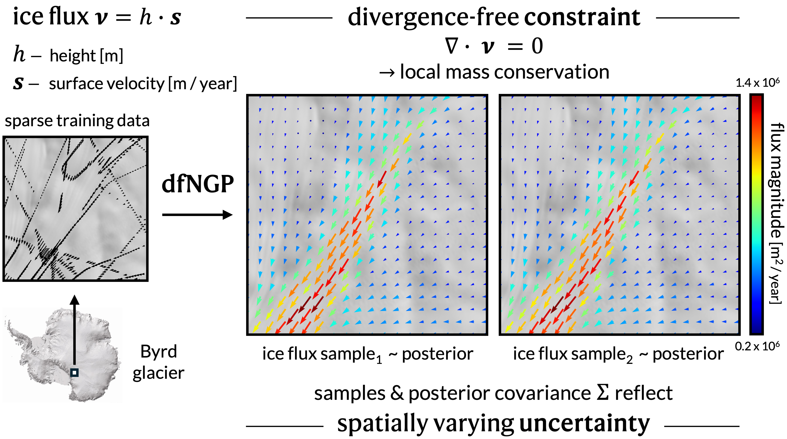

# dfNGP
Divergence-free Neural Gaussian Processes 

## Run experiments

### Set up the environment

Follow these steps to set up the environment for reproducing our results.

Create a new environment named `dfngp_env` with Python 3.10: 

`conda create -n dfngp_env python=3.10`

Follow the prompts to complete creation. Then activate the environment with:

`conda activate dfngp_env`

To install the CUDA-enabled version of PyTorch, use the appropriate build for your system. Our experiments were run using a GPU with CUDA 12.1, so we install:

`pip install torch==2.5.1 torchvision torchaudio --index-url https://download.pytorch.org/whl/cu121`

Next, use `pip` to install all required packages from the `requirements.txt` file, as well as their dependencies.

`pip install -r /home/kim/ice_thickness/requirements.txt`

Installation may take a few minutes.

### Experiments on simulated data

Once dfNGP_env is activated, run the experiments on simulated data with the following commands from the terminal:

- `python run_sim_experiments_dfGP.py`
- `python run_sim_experiments_dfGPcm.py`
- `python run_sim_experiments_dfNGP.py`
- `python run_sim_experiments_dfNN.py`
- `python run_sim_experiments_GP.py`
- `python run_sim_experiments_PINN.py`

All results and outputs will be saved in the respective model folder within [results_sim](results_sim). We will not upload all results to github due to space limitations. Each script runs each experiment for NUM_RUN = 8 times with different initialisations for a robust evaluation. 

### Experiments on real data

The already preprocessed train & test pytorch tensors containing real data from three regions within the Byrd glacier catchment in East Antarctica are provided in [real_data](data/real_data). Experiments on REAL will use these tensors. Once dfNGP_env is activated, run the experiments on real data with the following commands from the terminal:

- `python run_real_experiments_dfGP.py`
- `python run_real_experiments_dfGPcm.py`
- `python run_real_experiments_dfNGP.py`
- `python run_real_experiments_dfNN.py`
- `python run_real_experiments_GP.py`
- `python run_real_experiments_PINN.py`

All results and outputs will be saved in the respective model folder within [results_real](results_real). 

For greater reproducibility, transparancy, and data provenance we also provide the full **preprocessing pipeline** from data download to train/test tensor.

## Preprocessing pipeline - Real Antarctic ice flux data

Preface: To reproduce the real data experiments, you can also just run the scripts on the provided, much smaller, already preprocessed data. We include the following downloading and preprocessing pipeline for full **reproducibility**.

### Download
- In `download_bedmap123.py` replace `path_to_bedmap_data_folder` with your own local path. Run the python script with `python download_bedmap123.py` from the terminal. This will automatically download, unzip, and organise all bedmap data files. This script works on the os operating system. If you have trouble with this script or you are not on os, also see this [BAS resource from the Geophyscis Book by the UK Polar Centre](https://antarctica.github.io/PDC_GeophysicsBook/BEDMAP/Downloading_the_Bedmap_data.html) for useful information.
- 
<strong>WARNING:</strong> This script downloads 11 GB of data!

    - Bedmap1: 0.157 GB
    - Bedmap2: 3.2 GB
    - Bedmap3: 6.8 GB
- The script directly downloads all standardised .csv files from the Bedmap1, Bedmap2 and Bedmap3 collections from the [UK Polar Data Centre](https://www.bas.ac.uk/data/uk-pdc/). The list of .csv files are visible [on this Bristish Antarctic Survey (BAS) webpage](https://www.bas.ac.uk/project/bedmap/#data).
- Also check out this [Github repository](https://github.com/kimbente/bedmap) for some additional analysis of Bedmap123 data.

### Preprocess

- In `preprocess_bedmap123.py`, specify your preference about which variable you care about by setting bool_remove_rows_without_ice_thickness and/or bool_remove_rows_without_bed_elevation. Also make sure you set `path_to_bedmap_data_folder` to the same path you used for the download script. We set `bool_remove_rows_without_ice_thickness = True` because we will be using ice thickness measurements.
    - For only `bool_remove_rows_without_ice_thickness = True` the resulting data set contains ~ 82 M points (i.e. rows.) and is 9.5 GB large.
    - For only `bool_remove_rows_without_bed_elevation = True` the resulting data set contains ~ 67 M points (i.e. rows.)
- Run the script with `python preprocess_bedmap123.py` from the terminal.
- The script combines all csv files into a standardised pd Dataframe and performs a set of cleaning and preprocessing steps.
- Number of csv files to combine: 151 
    - Number of bedmap1 csv files: 1
    - Number of bedmap2 csv files: 66
    - Number of bedmap3 csv files: 84
- Next, the data is subsetted for the broader Byrd region. The subset of data for the 300 x 300 km Byrd glacier catchment area is more managable in size and only contains 750k data points, reducing the size to 0.085 GB.

### Create train and test data sets

- Run the notebook `real_data_preprocess_regions.ipynb` to generate the three x two pytorch tensors stored in [real_data](data/real_data).
- We use data from three regions within the wider Byrd glacier catchment. 
    - Upper Byrd (70 x 70 km)
    - Mid Byrd (70 x 70 km)
    - Lower Byrd (30 x 30 km)

Byrd Glacier drains a large part of the East Antarctic Ice Sheet (EAIS) and flows into the Ross Ice Shelf. See [Byrd Subglacial Basin](https://data.aad.gov.au/aadc/gaz/display_name.cfm?gaz_id=123177).

## List of files with brief explanantions

To aid navigation, we provide an alphabetical list of the main folders and files in this repository, along with brief descriptions of their contents.

- [data](data)
    - **real data** contains train and test data as pytorch tensors for the three selected regions of Byrd glacier, lower, mid and upper.
    - **sim_data**
        - [x_train_lines_discretised_0to1.pt](data/sim_data/x_train_lines_discretised_0to1.pt) defines the input locations for the simulated data experiments. The corresponding training vectors are generated within the experiment scripts, using the functions written in [simulate.py](simulate.py).
- [figues_real](figures_real)
    - 
- [figues_sim](figures_sim)
    - 
- [README_assets](README_assets) stores the visualisations used within this README.md
- [results_real](results_real)
    - [generate_latex_results_table_real.py](latex_table/generate_latex_results_table_real.py) generates latex format table from REAL experiment results (truncating, formatting).
    - Due to size constraints, we do not upload all experimental outputs to GitHub. However, running the experiments will automatically generate and save all results and outputs in this directory.
- [results_sim](results_sim)
    - [generate_latex_results_table_sim.py](latex_table/generate_latex_results_table_sim.py) generates latex format table from SIM experiment results (truncating, formatting).
    - Due to size constraints, we do not upload all experimental outputs to GitHub. However, running the experiments will automatically generate and save all results and outputs in this directory.
- [configs.py](configs.py) specifies all hyperparameters like, for example learning rates and number of epochs, and also defines the initialisation ranges for GP hyperparameters. Other settings like carbon tracking or print frequencies can be adjusted here too. 
- [gpytorch_models.py](gpytorch_models.py) defines all GP-based (probabilistic) models using `gpytorch`. This includes **dfNGP, dfGP, dfGPcm, and the regular GP**. The divergence-free kernel is contained in this file too. The implementation leverages the `linear_operator` package.
- [metrics.py](metrics.py) contains metric functions that were required in addition to those provided by packages like gpytorch.
- [NN_models.py](NN_models.py) defines all purely neural network-based models using `torch`. This includes the **dfNN and PINN**. 
- [requirements.txt](requirements.txt) can be use to create a suitable conda environment to reproduce our experiments. The text file lists all key packages necessary to run our code, including the version specifications we used. The instruction to create this environment are given above. 
- [run_sim_experiments_dfGP.py](run_sim_experiments_dfGP.py) contains the script to run dfGP experiments on simulated data.
    - Results & outputs of these experiments are saved in results_sim/dfGP.
- [run_sim_experiments_dfGPcm.py](run_sim_experiments_dfGPcm.py) contains the script to run dfGPcm experiments on simulated data.
    - Results & outputs of these experiments are saved in results_sim/dfGPcm.
- [run_sim_experiments_dfNGP.py](run_sim_experiments_dfNGP.py) contains the script to run dfNGP experiments on simulated data.
    - Results & outputs of these experiments are saved in results_sim/dfNGP.
- [run_sim_experiments_dfNN.py](run_sim_experiments_dfNN.py) contains the script to run dfNN experiments on simulated data.
    - Results & outputs of these experiments are saved in results_sim/dfNN.
- [run_sim_experiments_GP.py](run_sim_experiments_GP.py) contains the script to run dfNN experiments on simulated data.
    - Results & outputs of these experiments are saved in results_sim/GP.
- [run_sim_experiments_PINN.py](run_sim_experiments_PINN.py) contains the script to run dfNN experiments on simulated data. 
    - Results & outputs of these experiments are saved in results_sim/PINN.
- [simulate.py](simulate.py) contains all functions to generate simulated divergence-free vector fields from inputs x, used in the simulated data experiments.
- [utils.py](utils.py) contains utility/helper functions, e.g. to make a grid.

## The divergence-free Neural Gaussian Process (dfNGP)

## Contact

For any comments, questions or otherwise, please contact kim.bente@sydney.edu.au

